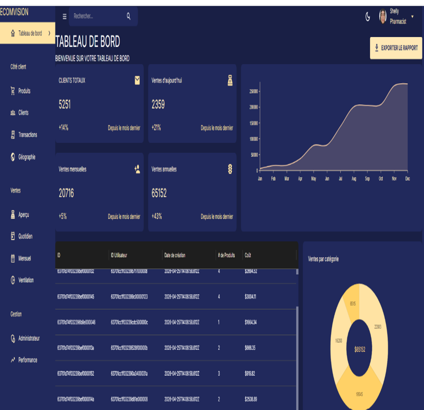
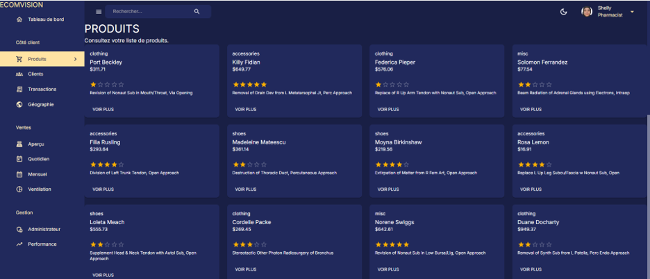
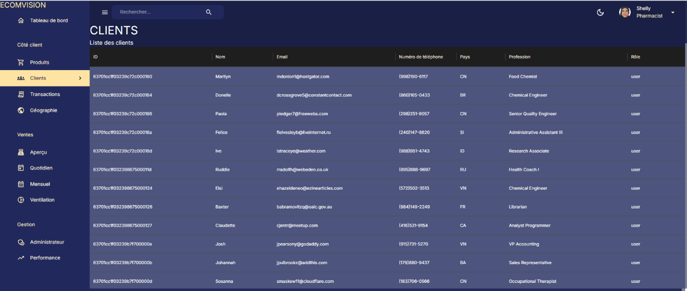
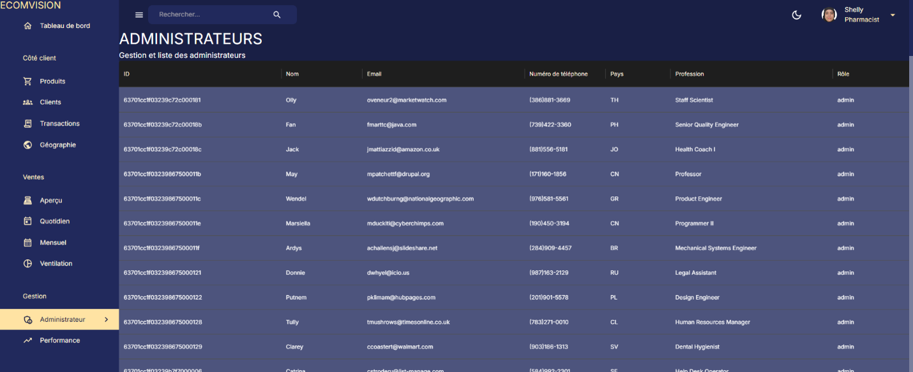
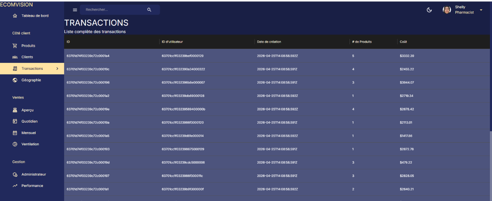
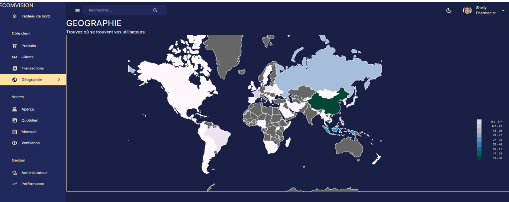
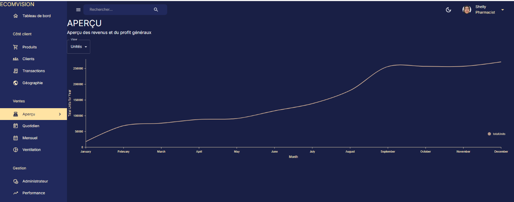
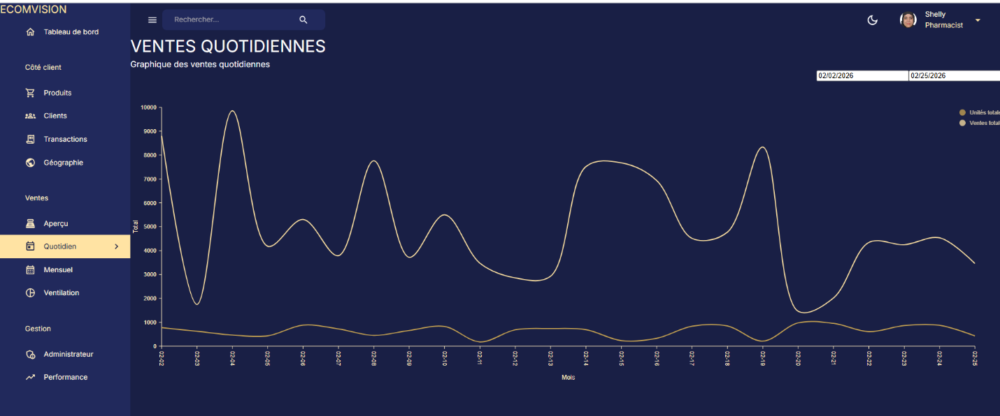
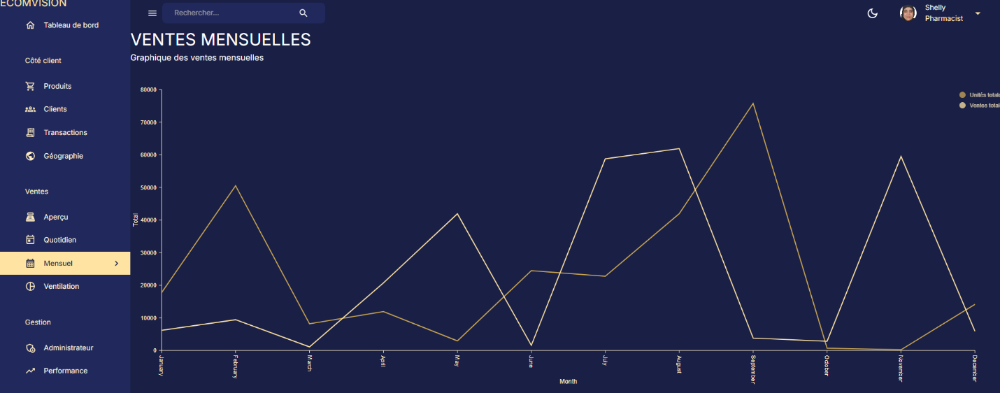
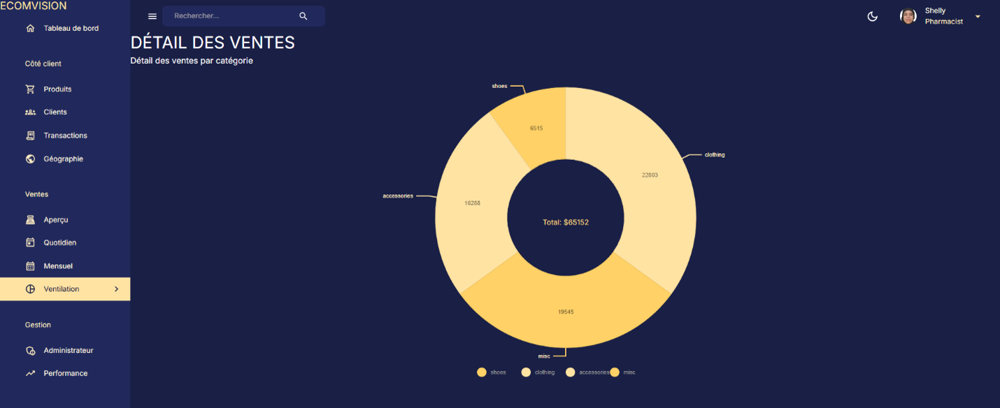

## Visual Presentation of the Application
### 1.Application Login Page:

This interface serves as the secure authentication gateway for our ECOMVISION platform, featuring a sleek, modern, and professional dark-themed design. It acts as a single point of entry for various user profiles (Client, Admin, and Super Admin), ensuring a seamless experience by dynamically loading the appropriate interface based on the user's role. Users can securely authenticate by providing their credentials (email and password) and clicking the primary button to access their dedicated dashboard or personalized workspace.
### 2.dashbord

The Main Dashboard serves as the central decision-making hub for the ECOMVISION platform, presented here with Super Admin privileges and a professional dark-themed design. The interface is structured into three key zones: a comprehensive left navigation menu for managing products, sales, and system administration; a dynamic KPI and visualization area displaying real-time metrics such as customer counts, sales growth, and revenue distribution via line and donut charts; and a central data grid that provides a transparent, timestamped view of recent transactions directly from the database. Additionally, the top navigation bar integrates essential global controls, including a centralized search, display mode toggles, user profile management, and a dedicated action button for instant statistical report exportation.
### 3. Products Management

The **Products** section provides targeted access to the entire item catalog directly from the ECOMVISION navigation menu. This interface allows users to instantly switch to a global view of all available products, enabling them to efficiently browse and filter through different categories.
### 4. Clients Management

Accessible via the "Client" navigation panel, this interface provides an exhaustive list of all end-users registered on the platform. It transparently displays essential contact information, including name, email, phone number, country of origin, and profession, all systematically associated with the "user" role. This view serves as a key tool for monitoring the growth and demographics of the global user base.
### 5. Administrators Management

The **Administrators** section activates a secure and restricted filter that exclusively lists staff members or management team members granted the "admin" role. This dedicated view provides the Super Admin with immediate visibility into all accounts holding elevated system privileges, ensuring efficient oversight of the administrative team.
### 6. Transactions (Sales Tracking)

Accessible via the "Client" navigation panel, this section provides a comprehensive view of all sales recorded on the platform. The table loads the entire commercial history in real-time, displaying the unique transaction ID, buyer ID, exact purchase date (ISO-formatted timestamp), quantity of items purchased, and the total cost. This module offers full transparency into the platform's global financial flow.
### 7. Geography (Geographic Analysis)

The **Geography** section features the platform’s decision-making mapping module. This interface integrates an interactive world choropleth map, powered in real-time by user and client location data stored in the database. Utilizing a color gradient correlated with a precise statistical legend (ranging from 0 to 60), it enables administrators to instantly visualize community density, identify high-activity markets—represented by the darkest geographical zones—and effectively steer global commercial and logistical strategies.
### 8. Overview (Global Sales Analysis)

Accessible under the "Sales" menu, this section features an interactive line chart that models the annual sales evolution curve (from January to December). A dropdown menu above the chart allows managers to instantly adjust the display based on selected metrics (here, "Units" sold), providing decision-makers with a clear and immediate view of annual performance to effectively guide commercial strategy.
### 9. Daily Sales Analysis

Accessible under the "Sales" menu, this section displays a dual-line chart that precisely tracks daily sales performance. Two date pickers located at the top right allow for filtering specific timeframes, dynamically adjusting the curves that represent total units and total sales. This module provides administrators with an essential short-term analysis tool to identify daily activity spikes and evaluate the direct impact of commercial operations.
### 10. Monthly Sales Analysis

Accessible under the "Sales" menu, this section features a dual-line chart that models overall business performance on a macroeconomic scale. The two superimposed curves continuously compare total units sold and total sales volume for each month of the year (January to December). This module serves as a powerful Business Intelligence tool, allowing decision-makers to analyze revenue seasonality, identify medium-term growth trends, and strategically plan commercial objectives.
### 11. Breakdown (Sales by Category)

Accessible under the "Sales" menu, this module features an interactive Donut Chart that illustrates the distribution of the platform's global revenue (currently $65,152). It dynamically segments financial performance across major product categories, such as Clothing ($22,803), Misc ($19,545), Accessories ($16,288), and Shoes ($6,515). This visual analysis tool is essential for instantly identifying the most profitable sectors within the product catalog.